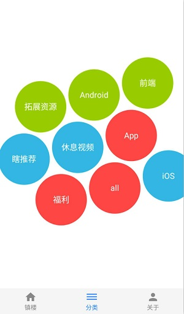

# G客户端
根据[干货集中营](http://gank.io)的网站公开的API实现的一个用于查看信息的客户端APP，正在不断美化界面、完善功能、优化代码，如果有什么问题欢迎反馈。

## 最新版APP下载
[Release](https://github.com/q1113225201/GClient/releases/latest)

### 首页
进入首页就是满满的妹子福利，这感觉perfect
 

### 分类
分类界面用了[igalata](https://github.com/igalata/Bubble-Picker)实现的仿iOS的气泡选择控件，挺酷炫的
 

### 详情
干货集中营的每日数据页面
 

