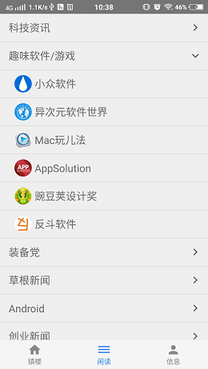
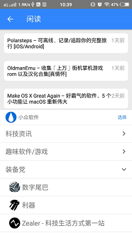

# G客户端
根据[干货集中营](http://gank.io)的网站公开的API实现的一个用于查看信息的客户端APP，当前已经可以查看每日干货、分类干货以及最新的闲读数据，项目正在不断美化界面、完善功能、优化代码，如果有什么问题欢迎反馈。

## 最新版APP下载
[Release](https://github.com/q1113225201/GClient/releases/latest)

### 首页
进入首页就是满满的妹子福利，这感觉perfect，右下角添加了一个可展开菜单管理干货分类。

### 闲读
闲读是干货集中营新开放的API，这里用了[树形列表](https://github.com/q1113225201/TreeView)展示大小分类。

### 闲读列表
闲读列表和干货分类的列表都是卡片式的，闲读列表最下面用[BottomSheetBehavior](https://developer.android.com/reference/android/support/design/widget/BottomSheetBehavior)实现了可选择分类的菜单。

### 详情
这是每日干货的列表数据，点击可以查看每条数据信息。

